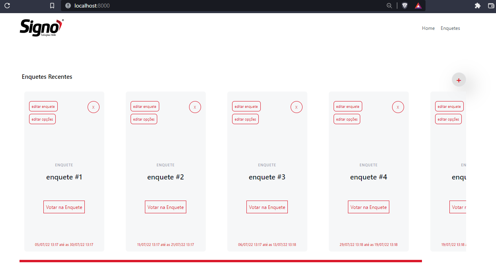

<!-- Badges session -->

  
  <!-- languages -->
  
  <!-- repo size -->
  
  <!-- last commit -->
  
  <!-- licence MIT -->
  

<!--Banner session-->

<!--About session-->
<h1 align="center">Avaliação de competência SISTEMA DE VOTAÇÃO</h1>

<h3>👨‍💻 Tecnologias utilizadas</h3>

- [HTML](https://www.w3schools.com/html/)
- [CSS](https://developer.mozilla.org/pt-BR/docs/Web/CSS)
- [JavaScript](https://developer.mozilla.org/en-US/docs/Web/JavaScript)
- [VUEJs](https://vuejs.org/)
- [TailwindCSS](https://tailwindcss.com/)
- [Laravel](https://laravel.com/)

<!--Bottom session-->
 <h4 align=center>Feito por <a target="_blank" href="https://robert-curriculo.netlify.app/" >Robert Uillians</a></h4>
