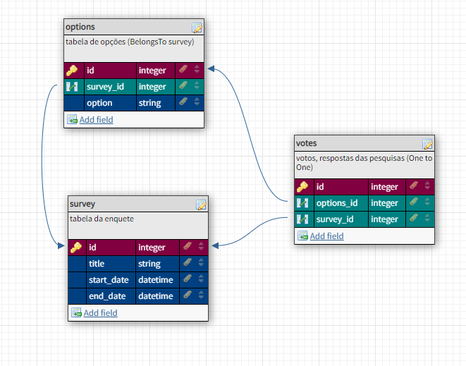

<!-- Badges session -->
<p align="center">  
  <!-- languages -->
  
  <!-- repo size -->
  
  <!-- last commit -->
  
  <!-- licence MIT -->
  
</p>

<!--Banner session-->
<p align="center"></p>

<!--About session-->
<h1 align="center">Avaliação de competência<br>SISTEMA DE VOTAÇÃO</h1>


<h2>🚶‍♂️ Instalação e configuração passo a passo </h3>

* Faça o Clone do repositório

```
git clone https://github.com/robert-office/vote-system.git
```

<h3>Instalando as dependências </h3>

* dentro da pasta do projeto:

```php
composer install
```

```js
npm install
```


<h3>👨‍💻 Ajustando o .env </h3>

* Crie um arquivo na raiz do projeto com o nome .env

* Copie tudo do .env.example para ele

* Gere a key do APP com o comando seguinte

```php
php artisan key:generate
```

* adicione/atualize os parametros seguintes:

```
BROADCAST_DRIVER=pusher
```

```
PUSHER_APP_ID=local
PUSHER_APP_KEY=local
PUSHER_APP_SECRET=local
PUSHER_HOST=127.0.0.1
```


<h2>👨‍💻 Ajustando o Banco de Dados </h3>

<p align="left"></p>

* No seu BD crie um banco de dados com o nome vote_system

* Execute a migração das tabelas do projeto

```php
php artisan migrate
```


<h2>👨‍💻 Inicializando o projeto localmente </h3>

* Este projeto utiliza o vite, websockets e o server para inicializar o servidor do laravel.

* Em 3 terminais powershell diferentes, execute:

```php
php artisan serve
```

```php
php artisan websockets:serve
```

```js
npm run dev
```

* Se tudo funcionar perfeitamente, o projeto estará rodando na: 127.0.0.1:8000 ou http:localhost:8000


<h3>👨‍💻 Tecnologias utilizadas</h3>

- [HTML](https://www.w3schools.com/html/)
- [CSS](https://developer.mozilla.org/pt-BR/docs/Web/CSS)
- [JavaScript](https://developer.mozilla.org/en-US/docs/Web/JavaScript)
- [VUEJs](https://vuejs.org/)
- [TailwindCSS](https://tailwindcss.com/)
- [Laravel](https://laravel.com/)

<!--Bottom session-->
<br><h4 align=center>Feito por <a target="_blank" href="https://robert-curriculo.netlify.app/" >Robert Uillians</a></h4>
